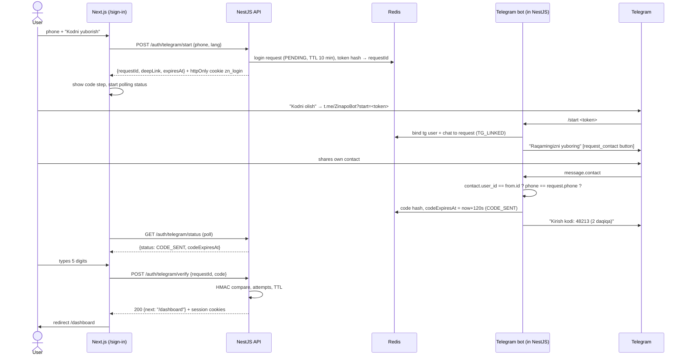

# Zinapo — Sign-in via Telegram (spec)

**Scope:** the sign-in page only, plus the backend and Telegram bot it needs.
**Stack:** frontend Next.js (App Router) · backend NestJS · PostgreSQL · Redis · Telegram Bot API.
**Template:** `zinapo-sign-in.html` (static HTML/CSS/JS reference for the Next.js page; runs in mock mode out of the box).

---

## 1. User flow

1. The user opens `/sign-in`, enters a phone number (`+998` prefix, 9 digits) and presses **Kodni yuborish**.
2. The site moves to the code step. It shows a 5-digit code field and a **Kodni olish** button. The button is a **unique Telegram deep link**: `https://t.me/<bot>?start=<token>`.
3. The user presses **Kodni olish**. Telegram opens the bot, and the bot asks the user to **share their phone number** with a "Raqamni yuborish" button.
4. The user shares their contact. The bot checks that it is the user's **own** contact and that the number **matches** the one entered on the site.
5. The backend generates a **5-digit code, valid for 2 minutes**, and the bot sends it.
6. The user types the code on the site. The backend verifies it and opens a session, and the site redirects to **`/dashboard`**.

On desktop the user often has Telegram only on the phone, so the code step also shows the deep link as a **QR code**.



---

## 2. Login request state machine

| Status | Meaning | Next |
|---|---|---|
| `PENDING` | Request created, deep link not opened yet | `TG_LINKED`, `EXPIRED`, `CANCELLED` |
| `TG_LINKED` | `/start <token>` received, waiting for the contact | `CODE_SENT`, `PHONE_MISMATCH`, `EXPIRED` |
| `PHONE_MISMATCH` | The shared number ≠ the entered number (terminal for this request) | user restarts on the site |
| `CODE_SENT` | Code issued, valid 120 s | `VERIFIED`, `LOCKED`, `EXPIRED`, `CODE_SENT` (new code) |
| `VERIFIED` | Session issued (terminal) | — |
| `LOCKED` | 5 wrong attempts (terminal) | user restarts |
| `CANCELLED` | User pressed "Bu men emasman" in the bot (terminal) | — |
| `EXPIRED` | 10-minute request TTL passed (terminal) | user restarts |

An expired **code** does not end the request. Within the 10-minute request window the user presses **Yangi kod** in the bot and gets a new code.

---

## 3. Limits and security rules

| Rule | Value |
|---|---|
| Code length | 5 digits, `crypto.randomInt(0, 100000)`, zero-padded |
| Code TTL | **120 s** |
| Wrong attempts per code | 5 → request `LOCKED` |
| Codes per request | max 3; "Yangi kod" cooldown 30 s |
| Login request TTL | 10 min |
| `start` rate limit | 3 per phone / 10 min, 10 per IP / hour |
| `verify` rate limit | 10 per IP / min (on top of per-code attempts) |
| Deep-link token | 32 random bytes, base64url (43 chars; Telegram allows ≤ 64 of `A-Za-z0-9_-`) |

Rules:

1. **Store only hashes.** For the deep-link token, store `sha256(token)`. For the code, store `HMAC-SHA256(OTP_SECRET, requestId + ":" + code)`. Compare with `crypto.timingSafeEqual`.
2. **The token is single-use and bound to one Telegram account.** The first `/start <token>` stores `tgUserId` and `chatId`. A `/start` with the same token from another Telegram user is rejected.
3. **Accept only the user's own contact:** `message.contact.user_id === message.from.id`. A forwarded or someone else's contact is rejected.
4. **Phone match:** normalize both numbers to E.164 (`libphonenumber-js`, region `UZ`). Telegram sends numbers with or without `+`.
5. **Bind verification to the browser.** `start` sets an httpOnly cookie `zn_login` holding a random secret, and its hash is stored in the request. `status` and `verify` require that cookie. A leaked `requestId` is useless in another browser.
6. **No enumeration.** `start` returns the same response whether or not the phone is registered.
7. **Anti-phishing text in the bot.** The code message names the browser, OS and time of the request, says "never share this code", and has a **"Bu men emasman"** button that cancels the request.
8. **Webhook auth.** Run Telegram in webhook mode with `secret_token`. Reject updates whose `X-Telegram-Bot-Api-Secret-Token` header doesn't match.
9. **Audit.** Write to the existing `audit_log` table: `auth.start`, `auth.tg_linked`, `auth.phone_mismatch`, `auth.code_issued`, `auth.verify_failed`, `auth.locked`, `auth.login`.
10. **Session cookies:**
    - Access JWT: 15 min, cookie `zn_at`.
    - Refresh token: 30 days, rotated on every use, cookie `zn_rt`, stored hashed in `auth_session`.
    - Both cookies are `httpOnly; Secure; SameSite=Lax; Path=/`.

---

## 4. API (NestJS)

All routes are under `/api`, which Next.js proxies to NestJS through rewrites (same origin, no CORS). Every request sends `credentials: 'include'`.

### `POST /api/auth/telegram/start`

```json
// request
{ "phone": "+998903124567", "lang": "uz" }

// 200
{ "requestId": "lr_01J9Z…", "deepLink": "https://t.me/ZinapoBot?start=Qm9…", "expiresAt": "2026-10-03T09:42:00Z" }
```

The response also sets `zn_login`. Starting again for the same browser cancels the previous request.

Errors: `400 PHONE_INVALID`, `429 RATE_LIMITED {retryAfter}`.

### `GET /api/auth/telegram/status?requestId=…`

```json
{ "status": "CODE_SENT", "codeExpiresAt": "2026-10-03T09:34:12Z", "attemptsLeft": 5, "codesLeft": 2 }
```

The client polls every 2 s until `CODE_SENT`, then every 5 s to catch a new code or a cancel. It stops on any terminal status. If you later want push instead of polling, swap this for SSE.

### `POST /api/auth/telegram/verify`

```json
// request
{ "requestId": "lr_01J9Z…", "code": "48213" }

// 200 (sets zn_at, zn_rt; clears zn_login)
{ "next": "/dashboard", "isNewUser": false }
```

Errors:

| HTTP | `error` | Extra |
|---|---|---|
| 400 | `CODE_INVALID` | `attemptsLeft` |
| 410 | `CODE_EXPIRED` | — (ask for a new code in the bot) |
| 423 | `LOCKED` | — (restart) |
| 410 | `REQUEST_EXPIRED` | — (restart) |
| 409 | `PHONE_MISMATCH` | — (restart with the right number) |
| 401 | `BROWSER_MISMATCH` | — (`zn_login` missing or wrong) |

### `POST /api/auth/refresh` · `POST /api/auth/logout`

These are standard: rotate or revoke `auth_session` and reset the cookies.

---

## 5. Redis keys

```
login:req:{requestId}   HASH  phone, lang, tokenHash, bindHash, status, tgUserId, chatId,
                              codeHash, codeExpiresAt, attempts, codesIssued, lastCodeAt,
                              ua, ip, createdAt                         TTL 600 s
login:tok:{tokenHash}   STRING requestId                                TTL 600 s
login:browser:{bindHash} STRING requestId   (to cancel the previous one) TTL 600 s
rl:start:phone:{e164}   counter                                         TTL 600 s
rl:start:ip:{ip}        counter                                         TTL 3600 s
```

Status changes and attempt increments must be atomic: use `MULTI` or a small Lua script for verify.

---

## 6. Database changes (PostgreSQL, on top of `schema.sql`)

```sql
ALTER TYPE verification_method ADD VALUE IF NOT EXISTS 'telegram_contact';

ALTER TABLE person ADD COLUMN telegram_user_id bigint;
CREATE UNIQUE INDEX person_telegram_unique ON person (telegram_user_id)
  WHERE telegram_user_id IS NOT NULL;

CREATE TABLE auth_session (
    id                 uuid PRIMARY KEY DEFAULT gen_random_uuid(),
    person_id          uuid NOT NULL REFERENCES person(id),
    refresh_token_hash bytea NOT NULL UNIQUE,
    user_agent         text,
    ip                 inet,
    created_at         timestamptz NOT NULL DEFAULT now(),
    last_used_at       timestamptz NOT NULL DEFAULT now(),
    expires_at         timestamptz NOT NULL,
    revoked_at         timestamptz
);
CREATE INDEX auth_session_person ON auth_session (person_id) WHERE revoked_at IS NULL;
```

On successful verify:

- **New phone:** create `person` with these fields:
  - `full_name` = Telegram `contact.first_name + ' ' + contact.last_name`. It is editable later, and `full_name` is `NOT NULL` in the schema.
  - `phone_verified_at = now()`
  - `verified_via = 'telegram_contact'`
  - `telegram_user_id`
  - `locale = lang`
- **Existing phone:** set `phone_verified_at` and `telegram_user_id`.
- **The phone is the account key.** If this `telegram_user_id` is linked to another person, unlink it there and write `audit_log`.

---

## 7. NestJS structure

```
src/
  auth/
    auth.module.ts
    auth.controller.ts          start / status / verify / refresh / logout
    login-request.service.ts    Redis state machine
    otp.service.ts              generate + HMAC + timing-safe compare
    session.service.ts          JWT + refresh rotation (auth_session)
    dto/start.dto.ts            class-validator: phone, lang in ['uz','ru','en']
  telegram/
    telegram.module.ts          nestjs-telegraf, webhook mode, secret_token
    telegram.update.ts          @Start, @On('contact'), @Action('new_code'|'not_me')
    bot-texts.ts                uz / ru / en messages
  common/
    phone.util.ts               libphonenumber-js → E.164, UZ only
    audit.service.ts            writes audit_log
```

Libraries: `nestjs-telegraf` + `telegraf`, `ioredis`, `@nestjs/throttler` (Redis storage), `@nestjs/jwt`, `libphonenumber-js`, `class-validator`.

### Core logic (sketch)

```ts
// otp.service.ts
generate(): string {
  return randomInt(0, 100_000).toString().padStart(5, '0');
}
hash(requestId: string, code: string): string {
  return createHmac('sha256', this.secret).update(`${requestId}:${code}`).digest('hex');
}
equals(a: string, b: string): boolean {
  const x = Buffer.from(a, 'hex'), y = Buffer.from(b, 'hex');
  return x.length === y.length && timingSafeEqual(x, y);
}
```

```ts
// telegram.update.ts
@Start()
async onStart(@Ctx() ctx: Context) {
  const token = (ctx as any).startPayload as string | undefined;
  const req = token && await this.login.findByToken(sha256(token));
  if (!req || req.status === 'EXPIRED') return ctx.reply(t(req?.lang, 'linkExpired'));
  if (req.tgUserId && req.tgUserId !== ctx.from.id) return ctx.reply(t(req.lang, 'linkUsed'));
  await this.login.linkTelegram(req.id, ctx.from.id, ctx.chat.id);           // → TG_LINKED
  return ctx.reply(t(req.lang, 'askPhone'), Markup.keyboard([
    Markup.button.contactRequest(t(req.lang, 'sharePhoneBtn')),
  ]).resize().oneTime());
}

@On('contact')
async onContact(@Ctx() ctx: Context) {
  const c = (ctx.message as any).contact;
  const req = await this.login.findByTelegramUser(ctx.from.id);               // latest TG_LINKED
  if (!req) return ctx.reply(t(undefined, 'startFromSite'));
  if (c.user_id !== ctx.from.id) return ctx.reply(t(req.lang, 'ownNumberOnly'));
  if (toE164(c.phone_number) !== req.phone) {
    await this.login.setStatus(req.id, 'PHONE_MISMATCH');
    return ctx.reply(t(req.lang, 'phoneMismatch'), Markup.removeKeyboard());
  }
  const code = await this.login.issueCode(req.id, { firstName: c.first_name, lastName: c.last_name }); // → CODE_SENT, 120 s
  await ctx.reply(t(req.lang, 'removeKb'), Markup.removeKeyboard());
  return ctx.reply(t(req.lang, 'code', { code, ua: req.ua, time: hhmm(req.createdAt) }), Markup.inlineKeyboard([
    Markup.button.callback(t(req.lang, 'newCodeBtn'), 'new_code'),
    Markup.button.callback(t(req.lang, 'notMeBtn'), 'not_me'),
  ]));
}
```

```ts
// auth.controller.ts → verify (inside one Lua/MULTI step)
// 1. request exists, bindHash matches cookie           else 401 BROWSER_MISMATCH / 410 REQUEST_EXPIRED
// 2. status === CODE_SENT                              PHONE_MISMATCH → 409, LOCKED → 423
// 3. now < codeExpiresAt                               else 410 CODE_EXPIRED
// 4. attempts < 5; equals(hash(id, code), codeHash)    else attempts++ → 400 CODE_INVALID {attemptsLeft} / 423 LOCKED
// 5. status = VERIFIED; upsert person; create auth_session; set cookies; audit auth.login
```

---

## 8. Next.js structure

```
app/
  [locale]/(auth)/sign-in/page.tsx      client component: steps phone → code → done
  [locale]/(app)/dashboard/page.tsx
middleware.ts                           no zn_at/zn_rt → redirect /sign-in; has them on /sign-in → /dashboard
lib/auth-api.ts                         start / status / verify (fetch, credentials: 'include')
hooks/useLoginStatus.ts                 polling (2 s → 5 s), stops on terminal status
components/auth/PhoneInput.tsx          +998 prefix, "90 312 45 67" mask, 9 digits
components/auth/OtpInput.tsx            5 boxes, paste, autocomplete="one-time-code", auto-submit
components/auth/TelegramButton.tsx      <a href={deepLink} target="_blank" rel="noopener">
components/auth/DeepLinkQr.tsx          qrcode (npm) → SVG, desktop only
next.config.js                          rewrites: /api/:path* → NestJS
messages/{uz,ru,en}.json                next-intl
```

The template's JS has the same three calls and the same state names. Port `render()` into React state and `api.*` into `lib/auth-api.ts`.

---

## 9. Copy (uz / ru / en)

### Site

| Key | uz | ru | en |
|---|---|---|---|
| title | Zinapoʻga kirish | Вход в Zinapo | Sign in to Zinapo |
| phoneLabel | Telefon raqami | Номер телефона | Phone number |
| sendCode | Kodni yuborish | Отправить код | Send code |
| getCode | Kodni olish | Получить код | Get the code |
| enterCode | Kodni kiriting | Введите код | Enter the code |
| codeValid | Kod {mm:ss} amal qiladi | Код действует {mm:ss} | Code valid for {mm:ss} |
| codeInvalid | Kod notoʻgʻri. Yana {n} ta urinish qoldi | Неверный код. Осталось попыток: {n} | Wrong code. {n} attempts left |
| codeExpired | Kod eskirdi. Botda «Yangi kod» tugmasini bosing | Код истёк. Нажмите «Новый код» в боте | Code expired. Tap “New code” in the bot |
| mismatch | Telegramdagi raqam kiritilgan raqamga mos kelmadi | Номер в Telegram не совпал с введённым | The Telegram number doesn’t match the one you entered |

### Bot

| Key | uz | ru | en |
|---|---|---|---|
| askPhone | Zinapoʻga kirish uchun telefon raqamingizni yuboring. | Чтобы войти в Zinapo, отправьте свой номер телефона. | To sign in to Zinapo, share your phone number. |
| sharePhoneBtn | Raqamni yuborish | Отправить номер | Share my number |
| code | Kirish kodi: **{code}**. 2 daqiqa amal qiladi. Kodni hech kimga bermang. Soʻrov: {ua}, {time}. | Код для входа: **{code}**. Действует 2 минуты. Никому не сообщайте код. Запрос: {ua}, {time}. | Sign-in code: **{code}**. Valid for 2 minutes. Never share it. Request: {ua}, {time}. |
| newCodeBtn | Yangi kod | Новый код | New code |
| notMeBtn | Bu men emasman | Это не я | This wasn’t me |
| phoneMismatch | Bu raqam saytda kiritilgan raqamga mos kelmadi. Saytga qaytib, toʻgʻri raqamni kiriting. | Этот номер не совпадает с введённым на сайте. Вернитесь на сайт и введите верный номер. | This number doesn’t match the one entered on the site. Go back and enter the right number. |
| ownNumberOnly | Iltimos, pastdagi tugma orqali oʻz raqamingizni yuboring. | Пожалуйста, отправьте свой номер кнопкой ниже. | Please share your own number with the button below. |
| linkExpired | Havola eskirgan. Saytga qaytib, qaytadan urinib koʻring. | Ссылка устарела. Вернитесь на сайт и попробуйте снова. | This link has expired. Go back to the site and try again. |
| linkUsed | Bu havola boshqa Telegram akkaunt bilan ochilgan. | Эта ссылка уже открыта другим аккаунтом Telegram. | This link was already opened by another Telegram account. |

The bot language follows the `lang` sent from the site, not Telegram's `language_code`.

---

## 10. Environment

```
TELEGRAM_BOT_TOKEN=
TELEGRAM_BOT_USERNAME=ZinapoBot
TELEGRAM_WEBHOOK_URL=https://zinapo.uz/api/telegram/webhook
TELEGRAM_WEBHOOK_SECRET=        # 32+ random chars
OTP_HMAC_SECRET=                # 32+ random bytes
JWT_ACCESS_SECRET=
REDIS_URL=
DATABASE_URL=
WEB_ORIGIN=https://zinapo.uz
```

Personal data must stay on servers inside Uzbekistan. Telegram only receives what the user sends their own bot. Keep Postgres and Redis in-country.

---

## 11. Acceptance checklist

- [ ] Phone field accepts only 9 digits after `+998`; the button is disabled until valid; the server validates again with `libphonenumber-js`.
- [ ] "Kodni olish" opens `t.me/<bot>?start=<token>`; the token is unique per request; opening it twice from another Telegram account is rejected.
- [ ] The bot asks for the contact with a `request_contact` button; a forwarded or someone else's contact is rejected.
- [ ] A different number → `PHONE_MISMATCH` shown in both the bot and the site; no code is issued.
- [ ] The code is 5 digits and expires after exactly 120 s; the site timer matches `codeExpiresAt` from the server.
- [ ] 5 wrong attempts → `LOCKED`; at most 3 codes per request; 30 s cooldown on "Yangi kod".
- [ ] `verify` from a browser without the `zn_login` cookie fails.
- [ ] The correct code → session cookies set → redirect `/dashboard`; `middleware.ts` keeps signed-in users out of `/sign-in`.
- [ ] "Bu men emasman" cancels the request, and the site shows it.
- [ ] Every step writes `audit_log`; codes and tokens never appear in logs.
- [ ] All texts exist in uz / ru / en; the page works in light and dark mode and at 360 px width.

## 12. Open questions

- **SMS fallback** for parents without Telegram (`sms` channel on the same request model)?
- **Returning users**: should "Kirish" be available from inside the bot without typing the phone (Telegram Login Widget)? This is out of scope for v1.
